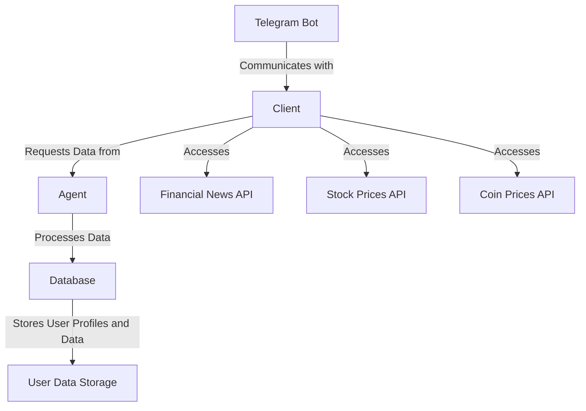
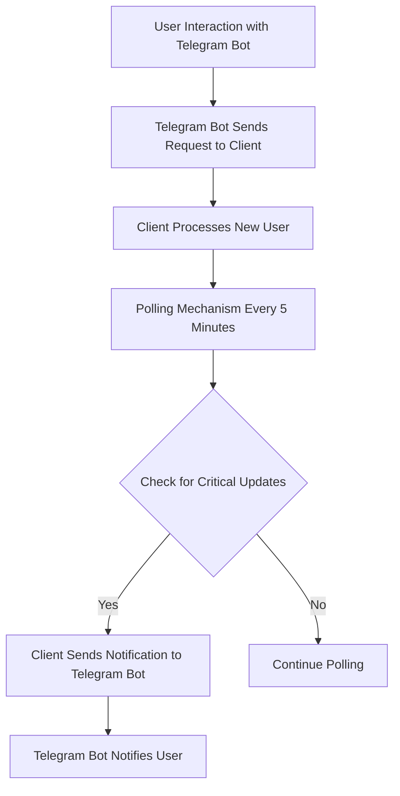
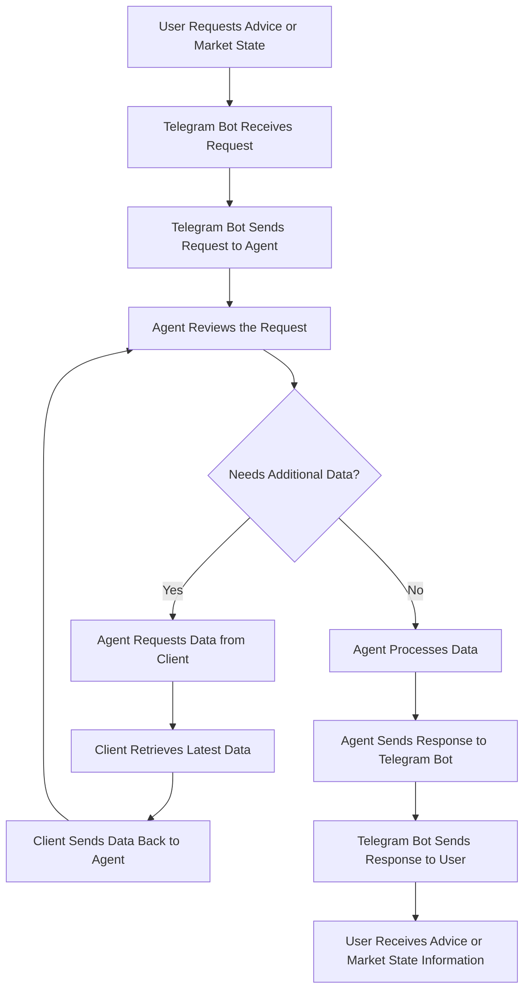

# Design Document for IVAN – Interactive Venture Analysis Network

## 1.1 Business Task Definition

### 1.1.1 Business Problem Statement

The financial market is complex and constantly changing, which makes it challenging for individual investors to make informed decisions regarding their portfolios. Many investors lack the tools and insights necessary to analyze market trends, news, and performance metrics effectively. As a result, they may miss out on profitable opportunities or fail to mitigate risks associated with their investments. **IVAN is designed to bridge this gap by providing an intelligent agent that offers real-time analysis and personalized recommendations, thereby empowering users to make informed investment decisions.**

### 1.1.2 Success Criteria

To measure the success of the IVAN project, the following criteria are set:

#### Direct Financial Success Criteria

-   **User Conversion**: The goal is to have 600 active paying users within the first six months after launch.
-   **Conversion Rate**: A conversion rate of at least 10% from free tier users to premium tier subscribers is expected within the first six months.

#### Indirect Operational Success Criteria

-   **Loss Mitigation**: Users should not experience a loss in their investment portfolios over a six-month period, except for unexpected market crashes or unpredictable world events.
-   **Response Time to Events**: Accurate investment advice should be given within 30 minutes of important market events or news that could affect user portfolios.

### 1.1.3 Business Requirements

The following business requirements must be met for the successful implementation of IVAN:

-   **Real-Time Data Processing**: The system must be able to process and analyze real-time market data and news.
-   **User Profile Management**: Users should be able to create and manage their investment profiles, including portfolio details and preferences.
-   **Personalized Recommendations**: The system must create tailored investment strategies based on user profiles and market conditions.
-   **Automated Notifications**: Users should receive timely updates and alerts about market changes and recommendations through a Telegram bot.
-   **Data Security**: All user data must be stored securely and follow relevant data protection regulations.

### 1.1.4 Business Constraints

**Budget Constraints**

-   **Development and Hosting**: The aim is to keep initial costs low by using open-source tools and running services locally during the early stages.
-   **Cloud Resources**: Free-tier cloud services (like AWS Free Tier or Google Cloud's free credits) are considered for testing and scaling when needed.

**Regulatory Considerations**

-   **Basic Data Security**: Sensitive user data, such as portfolio details, must be stored securely, with access limited to authorized users.
-   **Legal Disclaimer**: Users must be clearly informed that IVAN provides guidance and analysis only and is not a financial advisory or trading platform.

**Time Constraints**

-   **Prototype**: A working prototype should be completed within three months to show key features.
-   **Beta Testing**: A small group of testers will be used to improve the system during the second quarter of development.
-   **Final Release**: A stable and usable product is expected to be ready within six months of the project's start, focusing on core functionality over additional features.

### 1.1.5 Project Scope

The IVAN project scope includes the following deliverables:

**In Scope**

-   **Core Functionality**:
    -   Real-time data analysis from financial news and market APIs.
    -   User-specific portfolio monitoring and tailored investment advice.
    -   Automated Telegram notifications for market trends and user-specific alerts.
-   **System Features**:
    -   FastAPI backend to handle requests and manage workflows.
    -   LLM integration for personalized recommendations.
    -   PostgreSQL for in-memory and long-term data storage.
    -   Dockerized deployment for scalability and portability.

**Out of Scope**

-   **Direct Trading Features**: IVAN will not allow actual stock or cryptocurrency trading but will focus on analysis and recommendations.
-   **Advanced Machine Learning Models**: Pre-trained LLMs and APIs will be used to avoid resource-heavy model training initially.
-   **Desktop/Mobile Applications**: The focus is only on Telegram bot and web API integration for the initial phase.

### 1.1.6 Solution Prerequisites

**The Problem**  
Individual investors often find it hard to keep up with market changes and portfolio performance due to natural human tendencies, such as information overload and difficulty in processing real-time data. This can lead to missed opportunities and poor investment decisions, showing the need for better support in managing investments.

**The Solution**  
IVAN operates autonomously, continuously monitoring market news and stock/coin values. It notifies users of significant changes, providing tailored insights and recommendations through a Telegram bot. This empowers users to make informed investment decisions with minimal effort.

**Tech Stack**

**Backend Development**:

-   Python is the main language for its simplicity and ecosystem.
-   FastAPI serves as a lightweight framework for asynchronous APIs.
-   PostgreSQL provides a straightforward database solution for local development.

**User Interaction**:

-   The Telegram Bot API allows user-friendly interactions and notifications.

**Infrastructure**:

-   The system runs in a Dockerized local development environment, ensuring consistency. Plans for cloud migration exist to improve scalability and uptime after MVP success.
-   Version control is managed through GitHub.

### 1.1.7 Solution Flowchart

#### Flowchart 1: Infrastructure Overview

#### Flowchart 2: Telegram Bot - Client - Agent Communications

#### Flowchart 3: User Request for Advice or Market State

# 2. Methodology

## 2.1. Problem Definition

The technical problem to be solved is developing an autonomous Telegram bot that provides real-time, personalized investment recommendations using large language models (LLMs). The system includes a backend, integration with financial data APIs, database for data storage, and a Dockerized environment for scalability and efficient data processing.

## 2.2 Solution Flowchart

The flowchart will include the following key stages:

-   **Data Preparation**: Final processing and formatting of data based on EDA results.

-   **Model Development**: Integration of a pre-trained LLM model for generating recommendations and analyzing financial data.

-   **MVP Deployment**: Finalizing the system for the MVP release, integrating it with key channels, and preparing it for initial user interaction.

## 2.3 Stages of the problem-solving process

### **Stage 1. Data preparation**

#### **Description of the data/entities**

-   **Identified Issues with Volume, Quality, or Labeling**:  
    The three data sources (NewsAPI, Coinbase, and AlphaVantage) provide high-quality data with no significant issues in terms of volume, quality, or labeling. All the data is structured in a JSON format, which is easy to parse and process. There are some missing news on the NewsApi side (8%) on simple request, but it's easily solvable programmatically, so agent won't receive "Removed" articles, and will get other articles instead. Labeling aligns with standard market data conventions.

-   **Risks and Problems Identified During EDA**:  
    During the exploratory data analysis (EDA) stage, it was confirmed that all three APIs are suitable for the task. The only potential risk is related to the frequency of updates, which may vary slightly between the sources, especially during market off-hours. However, these risks do not impact the overall suitability of the data for real-time analysis and decision-making.

#### **Description of the data generation process**

-   **Data Source**:  
    The data is sourced from three external APIs: NewsAPI (for market news), Coinbase (for cryptocurrency prices), and AlphaVantage (for stock prices). These APIs provide real-time and historical data, offering a comprehensive view of market conditions.

-   **Data Format**:  
    The data from all three APIs is provided in JSON format, which is easily parsed and converted into structured DataFrames (using pandas). This format is well-suited for integration with the system, as it can be processed and analyzed by the LLM without additional transformation.

-   **Process Overview**:  
    Data is fetched periodically from the APIs using automated requests. After receiving the JSON data, it is parsed and converted into a pandas DataFrame. The LLM directly analyzes this data to provide insights in real-time. There are no current plans for storing the data, but in the future, we may consider storing embeddings or analysis results in a database for further use.

-   **Data Regularity**:  
    The data generation process is regular, with scheduled updates from each of the APIs. The frequency of updates is consistent across the sources, ensuring that the system receives timely data for analysis.

#### **Required Result of the Stage**

At the end of Stage 1, we should have services in place to fill the gaps in the data (i.e. removed news entries). These services will extract the most important parts of the data, calculate the necessary financial metrics, and be able to provide this processed information to the LLM for further analysis and decision-making.

### Stage 2. Preparing Predictive Models

#### **Description of ML Metrics and Loss Functions Selected to Solve the Problem**

Since the project utilizes a pre-trained LLM and does not involve training a predictive model from scratch, the focus shifts to the optimization of the agent's prompts and the evaluation of its responses. The performance of the LLM will be evaluated based on the relevance and accuracy of the insights it provides, as well as its ability to make sound investment recommendations. Key evaluation metrics will include:

-   **Relevance**: How well the agent's responses align with market trends and the user's portfolio.
-   **Accuracy**: The correctness of the recommendations, measured against historical market data.
-   **Actionability**: The ability of the agent's recommendations to lead to actionable investment decisions.
-   **Format Adherence**: The LLM's ability to generate insights in the requested format, ensuring that the output is structured and easy to interpret for the user.

Since no traditional loss functions (like MSE or Cross-Entropy) are used, the focus is on qualitative evaluation through historical data testing.

#### **Description of the ML Validation Scheme**

Given that the LLM agent is not a predictive model in the traditional sense, the validation scheme will focus on testing the agent's ability to provide accurate and actionable insights based on historical market data. The validation process will involve:

-   **Testing on Historical Data**: The LLM will be evaluated using 6 months of historical market data to assess how well it can analyze trends and make recommendations.
-   **Cross-validation with User Feedback**: In addition to historical data, the system will be validated with user feedback on the relevance and quality of recommendations. This feedback will help fine-tune the LLM's responses and improve its performance.

The validation scheme will take into account the need for real-time responsiveness, meaning that the system's performance will be evaluated not just on accuracy but also on the timeliness of the recommendations.

#### **Description of the Baseline Structure**

Since the solution relies on a pre-trained LLM, the baseline structure for the agent involves the following steps:

1. **Preprocessing**: Data from APIs (market news, stock prices, and coin prices) will be parsed and converted into DataFrames for analysis. The LLM will be fed this data in a structured format.
2. **Prompt Engineering**: The LLM will be provided with carefully crafted prompts designed to extract relevant insights from the data. This will involve defining specific tasks for the agent, such as identifying trends, suggesting portfolio adjustments, or analyzing market news.
3. **Modeling Process**: The agent will use the pre-trained LLM (such as GPT-4 or LLaMA) to generate responses based on the input data. There will be no traditional model training, but rather fine-tuning of the prompts and evaluation of output quality.

#### **Strategies for Further Development of the Solution**

To improve the LLM's performance and the overall system, the following strategies will be employed:

-   **Model Selection**: Fine-tuning the selected pre-trained LLM models (such as GPT-4 or LLaMA) on domain-specific financial data could further enhance the relevance of the agent's recommendations.
-   **Preprocessing and Feature Engineering (FE)**: Experimenting with different ways to preprocess market data, such as extracting key features or aggregating data over different time windows, could improve the LLM's ability to generate actionable insights. Also, different financial metrics can be calculated on our side and provided to the LLM.
-   **Hyperparameter Optimization**: While the model itself is pre-trained, optimizing the parameters for prompt generation (e.g., temperature, max tokens) can improve the specificity and quality of the agent's output.

#### **Analysis and Interpretation of the Model's Operation**

Since the LLM is not a traditional predictive model, its operation will be analyzed based on the following criteria:

-   **Response Quality**: The relevance, accuracy, and actionability of the LLM's responses will be analyzed in the context of historical market data.
-   **Real-Time Performance**: The speed and responsiveness of the agent in generating insights and recommendations will be monitored, especially in the context of real-time data processing.
-   **User Feedback**: Ongoing analysis of user feedback will help refine the LLM's responses and ensure that it meets user expectations for accuracy and relevance.

#### **Risks of This Stage and Ways to Reduce Them**

-   **Risk of Irrelevant Responses**: Since the LLM relies on prompts, there is a risk that the agent may generate responses that are not directly actionable or relevant to the user's portfolio. This can be mitigated by refining the prompts and continuously testing the agent with real historical data.
-   **Data Overload**: The system may struggle to handle large amounts of real-time data. To mitigate this, the data processing pipeline will be optimized for efficiency, and the LLM prompt will be adjusted to find and focus on the most relevant data points.
-   **Model Drift**: Over time, the financial market may change, and the pre-trained LLM might not be as effective in predicting trends. This can be addressed by regularly updating the LLM's prompts.

#### **Required Result of the Stage**

The goal of this stage is to ensure that the LLM can generate relevant, accurate, and actionable insights based on historical data. The model should be able to analyze market trends, suggest portfolio adjustments, and provide timely notifications to users. The system should also be validated against historical data to ensure that it can handle real-time data effectively.

### Stage 3. MVP Deployment

We intend to launch the MVP with the baseline model, so other backend parts and the Telegram bot should be ready as well. Most of the work on testing, optimization, and user feedback has already been covered in Stage 2. This stage focuses on finalizing the system, integrating all components, and preparing for deployment. The main objective is to ensure that the system is fully operational, with the LLM model in place, and ready for initial user interaction.

# 3. Pilot preparation

## 3.1 Pilot Evaluation Method

To evaluate the IVAN pilot, we will conduct several A/B tests to assess various aspects of the service. The effectiveness of these tests will be measured based on the following parameters:

-   **Portfolio Performance**: Evaluating the impact of different recommendation strategies on user portfolio outcomes.
-   **Response Accuracy**: Analyzing the relevance of recommendations through user feedback and market results.
-   **User Satisfaction**: Gathering insights from regular user surveys to understand service satisfaction levels.
-   **Response Time**: Measuring the speed at which IVAN delivers insights following significant market events.
-   **Metrics such as User Retention & Daily Active Users**: Tracking user engagement and retention to assess the overall effectiveness of the service.

The A/B tests will focus on various elements such as notification types, recommendation strategies, user interface variations, onboarding processes, pricing models, feedback mechanisms, and market data sources to optimize the overall user experience and service effectiveness.

## 3.2 Pilot Success Criteria

The pilot will be considered successful if we observe statistically significant improvements in:

-   **Portfolio Performance**: Users with IVAN show better portfolio performance compared to the control group
-   **Response Speed**: Significant reduction in time between market events and user awareness
-   **User Satisfaction**: Positive trend in user feedback and satisfaction ratings
-   **User Engagement**: Positive trend in engagement rates and daily active users
-   **Conversion Rate**: At least 10% conversion from free to premium tier within the first six months, which will allow to move to cloud hosting and increase scalability

## 3.3 Pilot Preparation

### Load Analysis

-   Evaluation of maximum requests the LLM can process in real-time
-   Testing system performance under various user loads
-   Establishing queue management for peak periods

### Resource Assessment

-   Calculation of computational resources needed for user request processing
-   Storage requirements for user profiles and market data
-   Network bandwidth requirements for real-time data feeds

### Budget Planning

-   Cloud vs Local infrastructure costs
-   API usage fees (NewsAPI, Coinbase, AlphaVantage)
-   Development and maintenance resources

### Experimental Constraints

-   Maximum number of users in the pilot based on available resources
-   API rate limits and their impact on scalability
-   Storage limitations for historical data

During the baseline experiment, we will refine computational complexity and adjust pilot parameters based on the collected data. With effective optimization of LLM inference time - such as efficiently storing processed news and historical data - we anticipate that costs will remain manageable. This is particularly important since the primary focus of the project is its autonomous notification system, rather than direct user interactions, which often drive up costs in LLM-based projects.

The main objective of the pilot preparation is to ensure that the system is fully operational, with the LLM model in place, and ready for initial user interaction.
