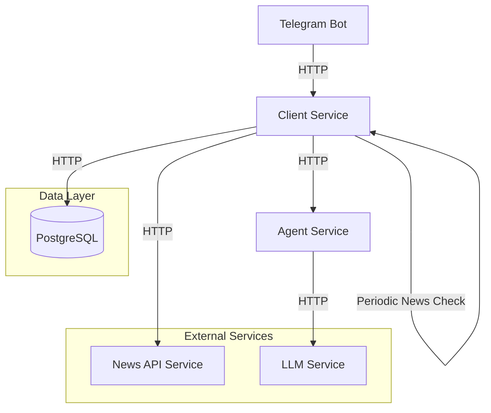
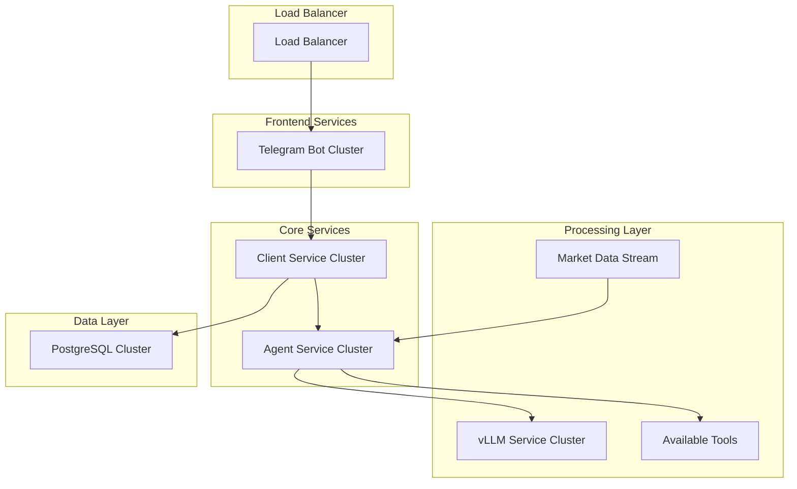

# Scaling Strategy for LLM Agent System

## Current Architecture Overview

## Scaling Strategy

### 1. Containerization and Orchestration

- **Technology**: Kubernetes (K8s)
- **Components**:
  - Deployment manifests for each service
  - Horizontal Pod Autoscaling (HPA)
  - Service meshes for inter-service communication
  - Ingress controllers for external traffic

### 2. Service-Specific Scaling Strategies

#### Telegram Bot Service
- **Scaling Approach**: Horizontal scaling with load balancer
- **Implementation**:
  - Deploy multiple instances behind a load balancer
  - Use Telegram Bot API's webhook mode for better distribution
  - Implement session affinity for ongoing conversations
- **Considerations**:
  - Maintain conversation state across instances
  - Handle webhook callbacks efficiently

#### Client Service
- **Scaling Approach**: Horizontal scaling with state management
- **Implementation**:
  - Deploy multiple instances
  - Use Redis for distributed caching
  - Implement circuit breakers for external service calls
- **Optimizations**:
  - Cache frequently accessed user data
  - Implement request queuing for LLM operations
  - Use connection pooling for database access

#### Agent Service
- **Scaling Approach**: Horizontal scaling with queue-based processing
- **Implementation**:
  - Deploy multiple instances
  - Implement message queue (RabbitMQ/Kafka) for request distribution
  - Use worker pools for LLM request processing
- **Optimizations**:
  - Implement request prioritization
  - Cache common LLM responses
  - Add request timeout and retry mechanisms

### 3. Database Scaling

#### PostgreSQL Scaling
- **Primary Strategy**: Master-Slave Replication
- **Implementation**:
  - Read replicas for query distribution
  - Connection pooling (PgBouncer)
  - Automated backup and recovery
- **Considerations**:
  - Data partitioning strategy
  - Backup and disaster recovery
  - Connection pool sizing

### 4. Caching Layer

- **Technology**: Redis Cluster
- **Implementation**:
  - Distributed caching for user sessions
  - LLM response caching
  - News data caching
- **Features**:
  - Cache invalidation strategies
  - TTL-based expiration
  - Circuit breaker pattern

### 5. Message Queue System

- **Technology**: RabbitMQ/Kafka
- **Use Cases**:
  - Async processing of LLM requests
  - News update distribution
  - User notification handling
- **Features**:
  - Message persistence
  - Dead letter queues
  - Priority queues

### 6. Monitoring and Observability

- **Components**:
  - Prometheus for metrics
  - Grafana for visualization
  - ELK Stack for log aggregation
  - Jaeger for distributed tracing
- **Key Metrics**:
  - Response times
  - Error rates
  - Queue lengths
  - Resource utilization

## Deployment Architecture

## Implementation Phases

### Phase 1: Containerization
1. Dockerize all services
2. Set up container registry
3. Create Kubernetes manifests

### Phase 2: Real-time Processing
1. Implement market data streaming pipeline
2. Set up event-driven agent activation
3. Configure parallel tool execution

### Phase 3: Agent Autonomy
1. Deploy vLLM service cluster for rapid inference
2. Implement autonomous decision making
3. Set up automated action execution

### Phase 4: Performance Optimization
1. Fine-tune market response latency
2. Optimize parallel processing
3. Implement predictive scaling

## Scaling Metrics and Thresholds

| Service | Metric | Threshold | Action |
|---------|---------|-----------|---------|
| Telegram Bot | CPU Usage | 70% | Scale out |
| Client Service | Request Queue Length | 1000 | Scale out |
| Agent Service | Market Event Processing Time | >100ms | Scale out |
| Agent Service | Decision Making Time | >1s | Scale out |
| LLM Service | Inference Latency | >500ms | Scale out |
| LLM Service | GPU Memory Usage | 80% | Scale out |
| Database | Connection Count | 80% | Add replica |

## Agent Autonomy Strategy

1. **Real-time Processing**
   - Stream processing of market events
   - Parallel tool execution
   - Asynchronous decision making

2. **Decision Making Pipeline**
   - Market event prioritization
   - Concurrent analysis of multiple events
   - Parallel tool invocation
   - Fast-path for critical market changes

3. **Action Execution**
   - Automated response triggers
   - Priority-based execution queue
   - Rollback mechanisms
   - Action verification loops

## Performance Optimization

1. **Latency Optimization**
   - Event stream processing optimization
   - Tool execution parallelization
   - LLM inference optimization
   - Response time monitoring

2. **Resource Allocation**
   - Dynamic GPU allocation
   - Tool instance scaling
   - Processing priority levels
   - Resource reservation for critical events

3. **Predictive Scaling**
   - Market volatility-based scaling
   - Historical pattern analysis
   - Pre-warming of resources
   - Load prediction models

## Security Considerations

1. **Market Data Security**
   - Encrypted market data streams
   - Secure event processing
   - Access control for market operations
   - Audit trails for all actions

2. **Agent Action Security**
   - Action verification mechanisms
   - Risk assessment checks
   - Operation limits and thresholds
   - Automated safety controls

3. **System Security**
   - Service mesh encryption
   - Network isolation
   - Regular security audits
   - Access control and authentication

## Monitoring and Alerts

1. **Performance Monitoring**
   - Market event processing latency
   - Decision making time
   - Tool execution duration
   - Action execution time
   - System resource utilization

2. **Market Response Monitoring**
   - Event detection time
   - Analysis completion time
   - Action execution latency
   - Market impact assessment

3. **System Health**
   - Service availability
   - Processing pipeline health
   - Tool availability and performance
   - Resource utilization trends

## Cost Optimization

1. **Resource Management**
   - Implement autoscaling based on demand
   - Use spot instances where applicable
   - Regular resource utilization review

2. **Caching Strategy**
   - Optimize cache hit rates
   - Implement intelligent TTL policies
   - Monitor cache effectiveness

3. **Database Optimization**
   - Query optimization
   - Index management
   - Connection pooling

## Maintenance and Updates

1. **Zero-Downtime Deployments**
   - Rolling updates
   - Blue-green deployments
   - Canary releases

2. **Backup Strategy**
   - Regular automated backups
   - Point-in-time recovery
   - Cross-region replication

3. **Monitoring and Alerts**
   - Service health checks
   - Performance monitoring
   - Error tracking and alerting 